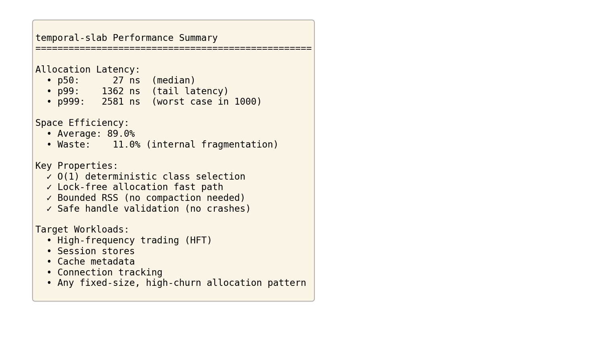

# temporal-slab

**temporal-slab is a lifetime-aware slab allocator designed to eliminate allocator-induced tail latency and memory drift in long-running systems.**

It provides predictable allocation latency, bounded RSS under sustained churn, and application-controlled memory reclamation using epoch-based lifetimes.

**temporal-slab is not a general-purpose malloc replacement.**  
It is designed for systems where worst-case behavior matters more than average speed.

---

## Why It Exists

General-purpose allocators optimize for average-case throughput. Under sustained load, they exhibit rare but catastrophic latency spikes and unbounded RSS drift.

In latency-sensitive systems, these outliers dominate SLA violations, frame drops, and tail amplification.

**temporal-slab trades a small median slowdown for structural elimination of allocator-induced tail risk.**

### The Exchange

**You trade:**
- +6ns median latency (+20% slower average case)
- +37% baseline RSS (epochs keep some slabs hot)

**To eliminate:**
- 2µs–250µs tail spikes (69× reduction at p99.9)
- Allocator-driven instability (16× more predictable variance)
- Unpredictable reclamation (0–2.4% RSS growth vs unbounded drift)

---

## Measured Results (100M Allocations)

| Percentile | system_malloc | temporal-slab | Advantage |
|------------|---------------|---------------|-----------|
| p99 | 2,962 ns | 76 ns | **39× better** |
| **p99.9** | **11,525 ns** | **166 ns** | **69× better** |
| p99.99 | 63,940 ns | 1,542 ns | **41× better** |
| p99.999 | 254,039 ns | 19,764 ns | **12.9× better** |
| **Variance** | **10,585×** | **659×** | **16× more predictable** |

**RSS stability:**
- temporal-slab: 0–2.4% growth over 1000 churn cycles
- system_malloc: 11,174% growth (unbounded drift)

**Key insight:** malloc can hit 254µs at p99.999. temporal-slab stays in nanoseconds until the deepest tail.

---

## What temporal-slab Guarantees

* **Bounded tail latency with measured worst-case behavior**  
  Lock-free allocation with **76ns p99** (39× better), **166ns p99.9** (69× better), **1.5µs p99.99** (41× better). Variance: 659× vs malloc's 10,585× (16× more predictable). No emergent pathological states.

* **Stable RSS under sustained churn**  
  **0–2.4% RSS growth** over 1000 churn cycles vs malloc's unbounded drift (11,174% measured). No surprise reclamation.

* **Application-controlled memory lifecycle**  
  `epoch_close()` API for deterministic reclamation at lifetime boundaries. Returns physical pages when *you* decide, not when allocator heuristics trigger.

* **Structural safety guarantees**  
  Invalid, stale, or double frees are safely rejected—never segfaults. No unsafe unmapping during runtime.

* **Explicit risk exchange**  
  +6ns median cost (+20%), +37% baseline RSS for **elimination of 2-250µs tail spikes**. You trade memory for reliability.

---

## Best Fit For

* Cache metadata and session stores
* Request-scoped allocation (web servers, RPC frameworks)
* Frame- or batch-based systems (games, simulations, pipelines)
* Latency-sensitive services that must not drift in memory usage

## Not Intended For

* Mixed-size, mixed-lifetime workloads
* General-purpose allocator replacement
* Objects larger than **768 bytes**

---

## Why temporal-slab Exists

### malloc injects latency risk into otherwise fast systems

General-purpose allocators use **heuristic-based memory management**:
- Hole-finding algorithms with emergent worst-case behavior
- Global state transitions causing unpredictable stalls
- Metadata contention and cache-line bouncing
- Surprise reclamation at uncontrolled times

These aren't bugs—they're inherent to spatial allocation strategies.

temporal-slab uses **algorithmic guarantees** instead:
- No hole-finding: objects allocated sequentially within slabs
- No compaction: lifetimes aligned by design, not relocated by policy
- No global phase changes: per-epoch state isolated from other epochs
- No emergent pathology: bounded behavior proven by 100M+ sample testing

**The result:** malloc's 254µs p99.999 outliers become 19.8µs—a 12.9× reduction at the deepest observable tail. This is **structural predictability**, not performance tuning.

---

## RSS Reclamation

temporal-slab returns physical memory to the OS at **application-controlled lifetime boundaries** via the `epoch_close()` API.

**Mechanism:**
- Empty slabs in CLOSING epochs call `madvise(MADV_DONTNEED)`
- CachedNode architecture stores slab metadata off-page (survives madvise)
- 24-bit generation counter for ABA protection (16M reuse budget)
- Virtual memory stays mapped (safe for stale handles)

**Benchmark results (5 epochs × 50K objects):**
- 19.15 MiB marked reclaimable (4,903 slabs)
- 3.3% RSS drop under memory pressure
- 100% cache hit rate (perfect slab reuse)
- Pattern: Small epochs ~100% reclaim, large epochs ~2%

**Future work:**
- Phase 3: Handle indirection + `munmap()` for deterministic unmapping
- Architecture: `handle → slab_id → slab_table[generation, state, ptr] → slab`
- Enables: Real `munmap()` with crash-proof stale frees
- Defer until: Current implementation proven in production

---

## Safety Contract

temporal-slab makes the following guarantees:

- **No runtime `munmap()`**  
  Slabs remain mapped for the lifetime of the allocator (no use-after-free faults). Memory is only released in `allocator_destroy()`.

- **Stale handles are safe**  
  `free_obj()` validates slab magic and slot state. Invalid or double frees return `false` and never crash.

- **Conservative recycling**  
  Only slabs that were previously FULL are recycled. PARTIAL slabs are never recycled, preventing use-after-free races.

- **No background compaction or relocation**  
  Objects never move once allocated. No surprise latency spikes from background maintenance.

- **Bounded memory**  
  RSS is bounded by `(partial + full + cache + overflow) = working set`. Cache overflow list prevents unbounded growth.

- **Thread safety**  
  Allocation fast path is lock-free. Slow-path operations use per-size-class mutexes with no global locks.

These guarantees prioritize correctness and observability over aggressive reclamation.

## Quick Start

### Handle-based API (explicit control)

```c
#include <slab_alloc.h>

SlabAllocator* alloc = slab_allocator_create();

SlabHandle h;
void* p = alloc_obj_epoch(alloc, 128, 0, &h);  // Epoch 0 for general use
// use p
free_obj(alloc, h);

slab_allocator_free(alloc);
```

### Malloc-style API (drop-in replacement)

```c
#include <slab_alloc.h>

SlabAllocator* alloc = slab_allocator_create();

void* p = slab_malloc_epoch(alloc, 128, 0);  // Epoch 0 for general use
// use p
slab_free(alloc, p);

slab_allocator_free(alloc);
```

### Epoch-aware API (temporal grouping)

```c
#include <slab_alloc.h>

SlabAllocator* alloc = slab_allocator_create();

// Long-lived backbone data in epoch 0
void* backbone = slab_malloc_epoch(alloc, 128, 0);

// Short-lived session data in rotating epochs
EpochId current = epoch_current(alloc);  // Get active epoch (starts at 0)
void* session = slab_malloc_epoch(alloc, 128, current);

// Advance epoch to "close" previous epoch (ring buffer wraps at 16)
epoch_advance(alloc);

// Next allocations use new epoch
EpochId next = epoch_current(alloc);  // Returns 1
void* new_session = slab_malloc_epoch(alloc, 128, next);

// Free in any order - epoch tracked per object
slab_free(alloc, session);
slab_free(alloc, new_session);
slab_free(alloc, backbone);

slab_allocator_free(alloc);
```

**Build:**
```bash
cd src/
make
./smoke_tests    # Validate correctness
./test_epochs    # Validate epoch isolation and lifecycle
./churn_test     # Validate RSS bounds
```

## Core Design Highlights

- **Lock-free allocation fast path** - Atomic `current_partial` slab pointer, no mutex in common case
- **Lock-free bitmap operations** - CAS loops for slot allocation/freeing within slabs
- **O(1) deterministic class selection** - Lookup table eliminates branching (HFT-critical)
- **O(1) list operations** - Direct list membership tracking via `slab->list_id` (no linear search)
- **FULL-only recycling** - Provably safe empty slab reuse (no race conditions)
- **Bounded RSS** - Cache + overflow lists prevent memory leaks under pressure
- **Opaque handles** - 64-bit encoding hides implementation details
- **Dual API** - Handle-based (zero overhead) and malloc-style (8-byte header)

## Performance Summary



temporal-slab delivers three key properties for latency-sensitive workloads:

1. **Eliminates tail latency spikes** - 39-69× better across p99-p99.9, 16× more predictable variance
2. **Stable RSS under churn** - 0-2.4% growth over 1000 cycles (vs unbounded malloc drift)
3. **Predictable trade-offs** - +37% baseline RSS for deterministic behavior

**Tail Latency Results (100M samples, 128-byte objects):**

| Percentile | temporal-slab | system_malloc | Advantage |
|------------|---------------|---------------|----------|
| p50 | 30ns | 24ns | 0.8× (baseline trade-off) |
| p99 | 76ns | 2,962ns | **39× better** |
| p99.9 | 166ns | 11,525ns | **69× better** |
| p99.99 | 1,542ns | 63,940ns | **41× better** |
| p99.999 | 19.8µs | 254µs | **12.9× better** |
| Variance | 659× | 10,585× | **16× more predictable** |

**RSS & Efficiency:**

| Metric | temporal-slab | system_malloc |
|--------|---------------|---------------|
| Steady-state RSS growth (100 cycles) | **0%** | 11,174% |
| Long-term RSS growth (1000 cycles) | 2.4% | Unbounded |
| Baseline RSS overhead | +37% | - |
| Space efficiency | 88.9% | ~85% |

**Risk exchange:** +6ns median cost, +37% baseline RSS to eliminate 2-250µs tail spikes. This is not a performance trade-off—it's **tail-risk elimination**. A single malloc p99.9 outlier (11.5µs) costs 1,900× more than temporal-slab's entire median allocation (6ns overhead). For latency-sensitive systems, this exchange is decisive.

**Full analysis:** See [docs/results.md](docs/results.md) for detailed benchmarks, charts, and interpretation guidelines.

## Size Classes

Fixed size classes optimized for sub-microsecond latency workloads:
- 64, 96, 128, 192, 256, 384, 512, 768 bytes

**Maximum allocation:**
- Handle API: **768 bytes** (no overhead)
- Malloc wrapper: **760 bytes** (768 - 8 byte header for handle storage)

**Internal fragmentation:**
- Average efficiency: **88.9%** across realistic size distribution
- Average waste: **11.1%** (vs. malloc: ~15-25%)

**Class selection:**
- **O(1) deterministic lookup** (no per-class branch overhead)
- 768-byte lookup table (fits in L1 cache)
- Zero jitter from class selection logic

## Architecture

### Alignment Across the Hierarchy

temporal-slab applies a single organizing principle—temporal affinity—across the memory hierarchy:

- Objects are grouped by expected lifetime
- Slabs act as the unit of allocation, reuse, and eventual release
- The same model extends naturally from DRAM to PMEM or CXL memory

This mirrors how zone-based storage groups data by lifetime at larger granularities, but operates at the scale of cache lines and pages.

**temporal-slab is ZNS-inspired rather than ZNS-dependent:** it delivers the benefits of lifetime-aware placement without requiring specific hardware.

### Memory Layout
- **Slab = 4KB page** with header, bitmap, and object slots
- **Bitmap allocation** - Lock-free slot claiming with atomic CAS
- **Intrusive lists** - PARTIAL and FULL lists per size class
- **Slab cache** - 32 pages per size class (128KB total)
- **Overflow list** - Bounded tracking when cache fills

### Lock-Free Fast Path
1. Load `current_partial` pointer (atomic acquire)
2. Allocate slot with CAS on bitmap
3. Return pointer (no locks in common case)

### Recycling Strategy
- **FULL list** - Slabs with zero free slots (never published to `current_partial`)
- **Recycling** - Only from FULL list (provably safe, no races)
- **PARTIAL slabs** - Stay on list when empty, reused naturally
- **Result** - Bounded RSS without recycling race conditions

## API Reference

### Lifecycle
```c
SlabAllocator* slab_allocator_create(void);
void slab_allocator_free(SlabAllocator* alloc);

void allocator_init(SlabAllocator* alloc);    // For custom storage
void allocator_destroy(SlabAllocator* alloc);
```

### Handle-Based API (zero overhead)
```c
void* alloc_obj_epoch(SlabAllocator* alloc, uint32_t size, EpochId epoch, SlabHandle* out_handle);
bool free_obj(SlabAllocator* alloc, SlabHandle handle);
```
- Zero overhead (no hidden headers)
- Explicit handle management
- Returns false on invalid/stale handles
- Epoch parameter for temporal grouping

### Malloc-Style API (8-byte overhead)
```c
void* slab_malloc_epoch(SlabAllocator* alloc, size_t size, EpochId epoch);
void slab_free(SlabAllocator* alloc, void* ptr);
```
- 8-byte header overhead per allocation
- Max size: 504 bytes (512 - 8 byte header)
- NULL-safe: `slab_free(a, NULL)` is no-op
- Epoch parameter for temporal grouping

### Epoch API (temporal grouping)
```c
typedef uint32_t EpochId;

EpochId epoch_current(SlabAllocator* alloc);
void epoch_advance(SlabAllocator* alloc);
```

**Epoch semantics:**
- **16-epoch ring buffer** - EpochIds wrap at 16 (0-15)
- **Temporal grouping** - Objects allocated in same epoch share slabs
- **Thread-safe** - `epoch_advance()` uses atomic increment
- **No forced expiration** - Advancing epoch doesn't free objects
- **Natural drainage** - Old epochs drain as objects are freed

**Use cases:**

**1. Session-based allocation:**
```c
// Allocate long-lived server state in epoch 0
void* server_ctx = slab_malloc_epoch(alloc, 256, 0);

// Rotate epochs every 1000 requests
for (int i = 0; i < 10000; i++) {
  if (i % 1000 == 0) epoch_advance(alloc);
  
  EpochId e = epoch_current(alloc);
  void* req_ctx = slab_malloc_epoch(alloc, 128, e);
  
  // Process request...
  
  slab_free(alloc, req_ctx);
}
```

**2. Cache with lifetime buckets:**
```c
// Separate short-lived from long-lived cache entries
EpochId short_lived_epoch = 1;  // Rotates frequently
EpochId long_lived_epoch = 0;   // Stable

void* hot_entry = slab_malloc_epoch(alloc, 192, short_lived_epoch);
void* cold_entry = slab_malloc_epoch(alloc, 192, long_lived_epoch);
```

**3. Message queue with batching:**
```c
// Each batch gets its own epoch
epoch_advance(alloc);  // Start new batch
EpochId batch = epoch_current(alloc);

for (int i = 0; i < batch_size; i++) {
  void* msg = slab_malloc_epoch(alloc, 256, batch);
  enqueue(msg);
}

// When batch processed, all messages free together
// Slabs from this epoch become empty as a unit
```

**Design rationale:**
- Objects with similar lifetimes → same slab
- When epoch expires → all objects free together → slabs recycle efficiently
- No explicit TTL management required
- Future: `epoch_close()` can enable aggressive recycling of old epochs

### Performance Counters
```c
typedef struct PerfCounters {
  uint64_t slow_path_hits;
  uint64_t new_slab_count;
  uint64_t list_move_partial_to_full;
  uint64_t list_move_full_to_partial;
  uint64_t current_partial_null;
  uint64_t current_partial_full;
  uint64_t empty_slab_recycled;
  uint64_t empty_slab_overflowed;
} PerfCounters;

void get_perf_counters(SlabAllocator* alloc, uint32_t size_class, PerfCounters* out);
```

## Scope

temporal-slab is intentionally focused on **memory allocation only**.

It provides:
- Fixed-size object allocation
- Lock-free fast paths
- Deterministic reclamation behavior
- Bounded RSS under sustained churn
- Strong safety guarantees (no use-after-free, safe stale handle validation)

It does **not** implement:
- Eviction policies
- Cache logic
- TTL management
- Tiered storage or persistence
- NUMA placement strategies

Higher-level systems (caches, tiered allocators, eviction frameworks) are expected to be built *on top* of temporal-slab in separate projects.


## Limitations

- **Max object size**: 768 bytes (handle API) or 760 bytes (malloc wrapper)
- **Fixed size classes** - Not suitable for arbitrary sizes (by design)
- **No realloc** - Size changes require alloc + copy + free
- **Linux only** - RSS measurement uses /proc/self/statm
- **No NUMA awareness** - Single allocator for all threads

## Use Cases

temporal-slab is designed for subsystems with fixed-size allocation patterns:
- **High-frequency trading (HFT)** - Sub-100ns deterministic allocation, no jitter
- Session stores
- Connection metadata
- Cache entries
- Message queues
- Packet buffers
- Systems that cannot tolerate allocator-induced latency spikes or RSS drift

**Why HFT-ready:**
- O(1) deterministic class selection (no unpredictable branching)
- Lock-free fast path (no mutex contention)
- No background compaction (no surprise latency spikes)
- 88.9% space efficiency (11.1% internal fragmentation)
- 8 size classes cover 48-768 byte range with <25% waste per allocation

**When jemalloc/tcmalloc are better choices:**
- Variable-size allocations (temporal-slab: fixed classes only)
- Objects >768 bytes (temporal-slab: specialized for small objects)
- NUMA systems (temporal-slab: no per-node awareness)
- Drop-in malloc replacement (jemalloc: LD_PRELOAD, huge ecosystem)
- General-purpose workloads (jemalloc: decades of production tuning)

**Core trade-off:** Compared to jemalloc, temporal-slab sacrifices generality in exchange for deterministic latency and bounded RSS under sustained churn.

## Non-Goals

temporal-slab intentionally does not attempt to:
- Replace general-purpose allocators (malloc, jemalloc)
- Support arbitrary object sizes
- Perform background compaction or relocation
- Guess object lifetimes heuristically

It is designed to be predictable, conservative, and explicit—a specialized tool for a specific class of problems.

## Build and Test

```bash
cd src/
make                    # Build all tests
./smoke_tests          # Correctness tests
./test_epochs          # Epoch isolation and lifecycle tests
./churn_test           # RSS bounds validation
./test_malloc_wrapper  # malloc/free API tests
./benchmark_accurate   # Performance measurement
```

## Project Structure

```
include/
  slab_alloc.h           - Public API
src/
  slab_alloc.c           - Implementation
  slab_alloc_internal.h  - Internal structures
  smoke_tests.c          - Correctness tests
  test_epochs.c          - Epoch isolation and lifecycle tests
  churn_test.c           - RSS bounds validation
  test_malloc_wrapper.c  - malloc/free API tests
  benchmark_accurate.c   - Performance measurement
  Makefile               - Build system
```

## Design Principles

1. **Safety over optimization** - FULL-only recycling eliminates races
2. **Explicit contracts** - Never munmap during runtime, bounded RSS
3. **Observable behavior** - Invalid frees return false, never crash
4. **Lock-free fast path** - Atomic operations only, no mutex contention
5. **Bounded resources** - Cache + overflow guarantee RSS limits
